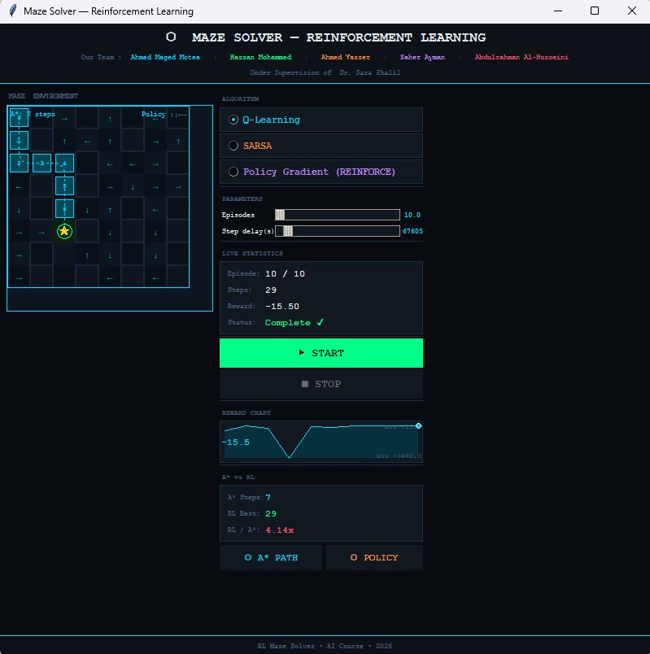
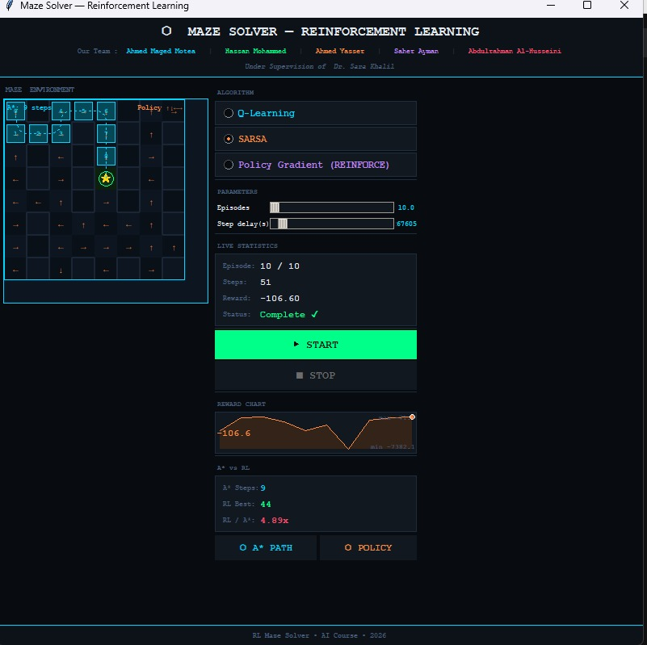

# Maze Solver using Reinforcement Learning

A reinforcement learning project that teaches intelligent agents how to solve a maze through **trial and error**.

The agent starts with no prior knowledge of the environment and gradually learns the optimal path to the goal using reward-based learning techniques.

---

## Project Overview

This project demonstrates how different **Reinforcement Learning (RL)** algorithms can be applied to maze navigation problems.

The environment is built using a **custom OpenAI Gym Maze Environment**, where agents interact with the maze, receive rewards, and improve their navigation strategy over time.

The project includes multiple RL agents and exploration policies for comparing learning performance and efficiency.

---

## Features

- Custom Maze Environment using OpenAI Gym
- Q-Learning Agent
- SARSA Agent
- Policy Gradient Agent
- A* Search Agent for comparison
- Greedy & Boltzmann Exploration Policies
- Interactive GUI Visualization
- Reward-based learning system
- Adjustable training parameters
- Real-time maze solving visualization

---

## 📸 Screenshots

### Q-Learning Agent



---

### SARSA Agent



---

## Reinforcement Learning Concepts Used

- **Q-Learning**
- **SARSA**
- **Policy Gradient Methods**
- **Exploration vs Exploitation**
- **Reward Optimization**
- **State-Action Value Functions**
- **Policy-Based Learning**

---

## Project Structure

```bash
Maze-Solver/
│
├── gym_maze/                 # Custom maze environment
├── AStarAgent.py             # A* search algorithm agent
├── QLearningAgent.py         # Q-Learning implementation
├── SarsaAgent.py             # SARSA implementation
├── PolicyGradientAgent.py    # Policy Gradient implementation
├── GreedyPolicies.py         # Greedy exploration strategies
├── BoltzmannPolicies.py      # Boltzmann exploration strategies
├── gui.py                    # GUI visualization
├── main.py                   # Main project entry point
├── setup.py                  # Project setup
└── README.md
```

---

## Installation

### 1️⃣ Clone the Repository

```bash
git clone https://github.com/AhmedYasser06/Maze-Solver.git
cd Maze-Solver
```

### 2️⃣ Create a Virtual Environment

```bash
python -m venv venv
```

### 3️⃣ Activate the Environment

#### Windows

```bash
venv\Scripts\activate
```

#### Linux / Mac

```bash
source venv/bin/activate
```

### 4️⃣ Install Requirements

```bash
pip install -e .
```

---

## Running the Project

Run the main application:

```bash
python main.py
```

The GUI window will open and display the maze environment where the agent learns and navigates toward the goal.

---

## Simulation Platform

This project uses:

- OpenAI Gym
- Custom Maze Environment

---

## Implemented Agents

| Agent | Description |
|------|-------------|
| **Q-Learning** | Off-policy temporal difference learning |
| **SARSA** | On-policy temporal difference learning |
| **Policy Gradient** | Learns policies directly |
| **A*** | Traditional shortest-path search algorithm |

---

## Exploration Policies

| Policy | Purpose |
|--------|---------|
| **Greedy Policy** | Exploits best-known actions |
| **ε-Greedy Policy** | Balances exploration and exploitation |
| **Boltzmann Policy** | Probabilistic action selection using temperature |

---

## How It Works

1. The agent starts at a random position in the maze.
2. It performs actions:
   - Up
   - Down
   - Left
   - Right
3. The environment provides rewards:
   - Positive reward for reaching the goal
   - Negative reward for invalid or inefficient moves
4. Over many episodes, the agent learns the optimal path.

---

## Example Learning Process

### Early Episodes
- Random movement
- Frequent collisions
- Inefficient paths

### Later Episodes
- Faster navigation
- Optimal route discovery
- Improved reward accumulation

---

##  Future Improvements

- Deep Q-Networks (DQN)
- Multiple maze difficulty levels
- Dynamic obstacles
- Saving/loading trained models
- Performance analytics graphs
- Multiplayer agent competition

---

## 👨‍💻 Author

**Ahmed Yasser**

GitHub: https://github.com/AhmedYasser06

---

## 📜 License

This project is open-source and available under the **MIT License**.
